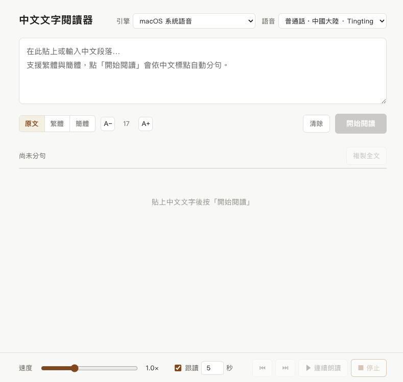

# 中文文字閱讀器

貼上一段中文，程式會依中文標點**自動分句**。點擊任何一句，就用普通話讀出來。
速度可調，亦有**跟讀模式**——讀完一句停一停，讓你跟著練習發音。

為練習普通話而做：寫好稿之後，先聽一句、跟讀一次，再逐句練下去。

<!-- 建議放一張截圖：把圖片存成 docs/screenshot.png，再把下面這行取消註解 -->
<!--  -->

---

## 特色

- **自動分句** — 依中文標點（`。！？；…`）切分，正確處理引號黏合、小數點、單雙省略號
- **點句即讀** — 點擊句子用普通話朗讀，支援簡體與繁體
- **速度可調** — 0.5× 至 2.0×
- **跟讀模式** — 每句之間停頓指定秒數，附倒數提示
- **連續朗讀** — 由第一句未讀的接續朗讀，可隨時暫停／停止
- **繁簡轉換** — 一鍵在簡體／繁體之間切換（只影響顯示，不影響發音）
- **複製** — 複製全文，或右鍵單句複製
- **字級可調** — 14–28pt
- **兩種語音引擎** — 離線系統語音，或音色較自然但需網絡的 neural 語音

## 安裝

需要 [Python 3.9+](https://www.python.org/downloads/)。
依賴管理用 [uv](https://docs.astral.sh/uv/)（會自動安裝）。

```sh
git clone https://github.com/cupofjava2/chinese-reader.git
cd chinese-reader
./run.sh
```

瀏覽器打開 <http://127.0.0.1:5000>。

> 程式只綁定 `127.0.0.1`，僅限本機存取，不會暴露到網絡。

### Windows

在 PowerShell 或 Git Bash 執行同樣的 `./run.sh`；若 shell 不支援，用：

```sh
uv sync --extra edge
uv run python app.py 5000
```

## 語音引擎

| 引擎 | 平台 | 離線 | 音色 |
|---|---|---|---|
| `say` — macOS 系統語音 | macOS | ✅ | 中等 |
| `edge` — edge-tts | 全平台 | ❌ 需網絡 | **自然**（14 個中文音色） |

`run.sh` 會一併安裝 edge 引擎。**沒網絡時不會出錯**——edge 引擎會顯示為不可用，
程式自動只用系統語音。

edge-tts 會把文字送到微軟的線上服務，**請勿用於敏感內容**。

### 關於 macOS 語音清單

macOS 的 `say -v ?` 會列出「支援」中文的語音，但新型語音（Eddy／Flo／Rocko…）
未必已下載中文語音資料，揀了會讀不出中文。本程式會掃描系統實際的語音資料，
只列出真係讀得到中文的語音。

## 測試

```sh
uv run python test_splitter.py   # 分句邏輯 17 項
uv run python test_server.py     # 後端整合 34 項（需要先啟動 server）
node test_ui.js                  # 前端邏輯 17 項（建議先啟動 server）
```

`test_server.py` 與 `test_ui.js` 會實際發出語音，運行時有聲音屬正常。

## 設計說明

**為什麼不需要 WebSocket？** `/api/speak` 會「阻塞到語音讀完」才回應，
所以「收到回應」就等於「這句讀完了」。前端據此推進度與高亮，
無需事件流，也不會有同步錯位。

**停止為什麼要世代計數？** 使用者連點句子時，「停止舊句」和「開始新句」會同時發生。
單靠鎖會出現「停止指令剛好殺掉新句」的競態，因此每次停止會遞增世代號，
朗讀中的句子若發現世代已變，就知道自己被取代並立即退出。

## License

MIT — 見 [LICENSE](LICENSE)。
